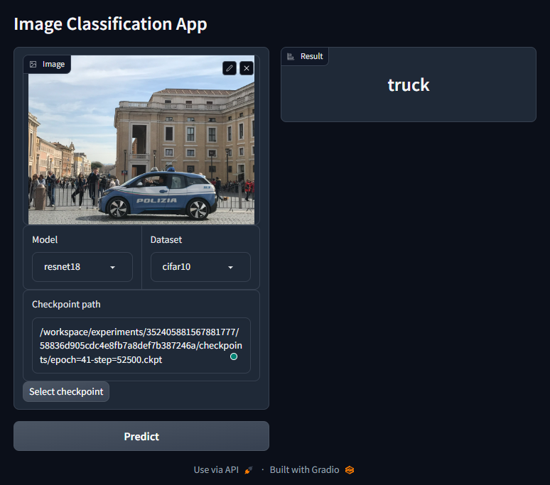

# DeepX

*Deep learning algorithms implemented with PyTorch and Lightning.*

[](https://opensource.org/licenses/MIT)

## Features

- Backbone

  - [x] ResNet
  - [ ] Vision Transformer
  - [x] Transformer

- Tasks

  - Vision
    - Classification
      - [x] ResNet
    - Segmentation
      - [x] UNet
    - Object Detection
      - [ ] YOLO
      - [ ] SSD
    - Image Generation
      - [x] GAN
  - Language
    - [x] Language Model
    - [ ] Text Classification
    - [ ] Translation

## Installation

- Docker installation:

```bash
./build.sh
```

- PyPI installation:

```bash
pip install -e .
```

## Usage

### Starting a container

```bash
./up.sh
```

### Training

#### Classification

- Terminal

```bash
python train.py --task classification --model resnet18 resnet50 --dataset mnist

# usage: train.py [-h] -t TASK -m [MODEL ...] [-bb BACKBONE] -d DATASET [-b BATCH_SIZE] [-e EPOCHS] [-do DROPOUT] [-r ROOT_DIR] [-mo MONITOR] [--debug] [--download]

# options:
#   -h, --help            show this help message and exit
#   -t TASK, --task TASK
#   -m [MODEL ...], --model [MODEL ...]
#   -bb BACKBONE, --backbone BACKBONE
#   -d DATASET, --dataset DATASET
#   -b BATCH_SIZE, --batch_size BATCH_SIZE
#   -e EPOCHS, --epochs EPOCHS
#   -do DROPOUT, --dropout DROPOUT
#   -r ROOT_DIR, --root_dir ROOT_DIR
#   -mo MONITOR, --monitor MONITOR
#   --debug
#   --download
```

- Python script

```python
# Using default config
from deepx.trainers import ClassificationTrainer

trainer = ClassificationTrainer(
    model="resnet18",
    datamodule="mnist",
)

trainer.train()
```

```python
# Using custom model
from deepx.trainers import ClassificationTrainer
from deepx.nn import MLP

model = MLP([64, 128, 10])

trainer = ClassificationTrainer(
    model=model,
    datamodule="mnist"
)

trainer.train(epochs=100, batch_size=128)
```

#### Segmentation

- Terminal

```bash
python train.py --task segmentation --model unet --dataset vocseg
```

- Python script

```python
from deepx.trainers import SegmentationTrainer

trainer = SegmentationTrainer(model="unet", datamodule="vocseg")

trainer.train()
```

#### Other examples can be found in `docs/examples/`.

### Visualization

```bash
bash dashboard.sh
```

or

```bash
mlflow server --backend-store-uri file:./experiments --host <host> --port <port>
```

### Inference

```bash
cd apps
python classify.py
```



## Development

### Profiling

```bash
python -m cProfile -o profile.prof train.py <args>
```
