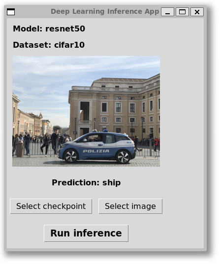

# DeepX

*Deep learning algorithms implemented with PyTorch and Lightning.*

[](https://opensource.org/licenses/MIT)

## Features

- Backbone

  - [x] ResNet
  - [ ] Vision Transformer
  - [x] Transformer

- Tasks

  - Vision
    - Classification
      -  [x] ResNet
    - Segmentation
      - [x] UNet
    - Object Detection
  - Language
    - [x] Language Model
    - [ ] Text Classification
    - [ ] Translation

## Installation

- Docker installation:

```bash
./build.sh
```

- PyPI installation:

```bash
pip install -e .
```

## Usage

### Starting a container

```bash
./up.sh
```

### Training

#### Classification

- Terminal

```bash
cd /tasks
python train.py --task classification --model resnet18 --dataset cifar10 --batch_size 128 --epochs 200 --debug
tensorboard --logdir experiments
```

- Python

```python
# Using default config
from deepx.tasks import ClassificationTrainer

trainer = ClassificationTrainer(
    model="resnet18",
    datamodule="mnist",
)

trainer.train()
```

```python
# Using custom model
from deepx.tasks import ClassificationTrainer
from deepx.nn import MLP

model = MLP([64, 128, 10])

trainer = ClassificationTrainer(
    model=model,
    datamodule="mnist"
)

trainer.train(epochs=100, batch_size=128)
```

#### Segmentation

- Terminal

```bash
cd deepx/tasks
python train.py --task segmentation --model unet --dataset voc --batch_size 128 --epochs 200 --debug
```

- Python

```python
from deepx.tasks import SegmentationTrainer

trainer = SegmentationTrainer(model="unet", datamodule="vocseg")

trainer.train()
```

### Inference

```bash
cd deepx/tasks
python inference.py
```



## Development

### Profiling

```bash
python -m cProfile -o profile.prof train.py <args>
```
