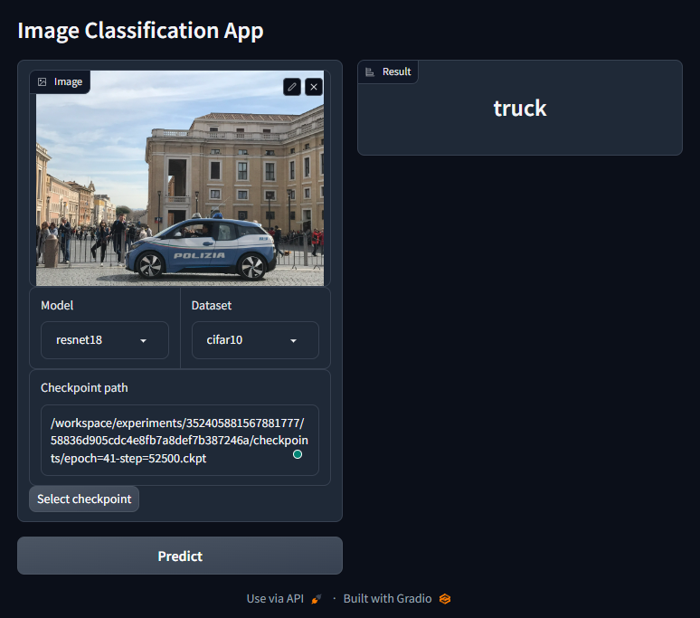

# DeepX

*Deep learning algos implemented with PyTorch and Lightning.*

[](https://opensource.org/licenses/MIT)

## Features

- Backbone

  - [x] ResNet
  - [ ] Vision Transformer
  - [x] Transformer

- Algorithms

  - Vision
    - Classification
      - [x] ResNet
    - Segmentation
      - [x] UNet
    - Object Detection
      - [ ] YOLO
      - [ ] SSD
    - Image Generation
      - [ ] VAE
      - [x] DCGAN
      - [ ] Diffusion Models
  - Language
    - [x] Language Model
    - [ ] Text Classification
    - [ ] Translation

## Installation

- Docker installation:

```bash
cd envs
docker compose up -d
```

- PyPI installation:

```bash
pip install -e .
```

## Usage

### Starting a container

```bash
docker exec -it deepx bash
```

### Training

#### Classification

- Python script

```python
# Using default config
from deepx.trainers import ClassificationTrainer

trainer = ClassificationTrainer(
    model="resnet18",
    datamodule="mnist",
)

trainer.train()
```

```python
# Using custom model
from deepx.trainers import ClassificationTrainer
from deepx.nn import MLP

model = MLP([64, 128, 10])

trainer = ClassificationTrainer(
    model=model,
    datamodule="mnist"
)

trainer.train(epochs=100, batch_size=128)
```

#### Segmentation

- Python script

```python
from deepx.trainers import SegmentationTrainer

trainer = SegmentationTrainer(model="unet", datamodule="vocseg")

trainer.train()
```

#### Other examples can be found in `docs/examples/` and `experiment/training/`.

### Experiment Tracking

Access `http://localhost:5000` in your browser.

### Inference

```bash
cd apps
python classify.py
```



## Development

### Profiling

```bash
cd experiments/training
python -m cProfile -o profile.prof <task>.py <args>
```
