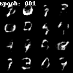

.. _training:

Training
========

Image Generation
----------------

MNIST
^^^^^

.. code-block:: bash

    cd experiments/training
    python imggenerator.py dataset=mnist machine=docker task=imggen

LFW
^^^

.. code-block:: bash

    cd experiments/training
    python imggenerator.py dataset=lfw machine=docker task=imggen

.. image:: ../_static/lfw.gif
    :align: center

Classification
--------------

MNIST

- Terminal

.. code-block:: bash

    cd experiments/training
    python classifier.py dataset=mnist machine=docker task=classification

- Python script

.. code-block:: python

    # Using default config
    from deepx.trainers import ClassificationTrainer

    trainer = ClassificationTrainer(
        model="resnet18",
        datamodule="mnist",
    )

    trainer.train()

.. code-block:: python

    # Using custom model
    from deepx.trainers import ClassificationTrainer
    from deepx.nn import MLP

    model = MLP([64, 128, 10])

    trainer = ClassificationTrainer(
        model=model,
        datamodule="mnist"
    )

    trainer.train(epochs=100, batch_size=128)
