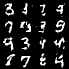

# Training examples

## Digit image generation

```python
cd /workspace
python train.py -a imagegen -m gan -bb mlp -b 32 -e 100 -bm -d mnist -do 0.1 -mo val_loss_d -w 8 -lr 1e-5 -lf bce -ratio 0.9 -p 10 -s none
```


