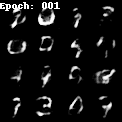

# Training examples

## Image generation

### MNIST

```bash
cd /workspace/experiments/training
python imggenerator.py dataset=mnist machine=docker task=imggen
```



### LFW

```bash
cd /workspace/experiments/training
python imggenerator.py dataset=lfw machine=docker task=imggen
```


